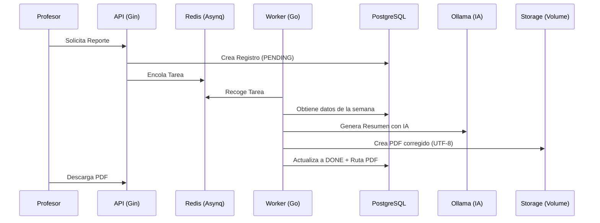

# Monitors Platform Backend - Guía de Pruebas E2E (Reportes con IA)

Este documento describe el flujo completo para probar la funcionalidad de generación de reportes asistidos por IA, desde la autenticación hasta la descarga del PDF.

## 1. Requisitos Previos
*   Docker y Docker Compose instalados.
*   Contenedores en ejecución: `docker-compose up -d`.
*   Modelo Ollama descargado: `docker exec monitors-platform-ollama-1 ollama pull qwen2.5:3b`.

## 2. Usuarios de Prueba
Se han configurado los siguientes usuarios con contraseña `password123`:
*   **Profesor:** `garcia@universidad.edu`
*   **Monitor:** `gamonitor@universidad.edu`

---

## 3. Flujo de Ejecución (Paso a Paso)

### Paso A: Autenticación (Login)
Primero, obtenemos los tokens JWT para ambos roles.

**Login Profesor:**
```bash
curl -X POST http://localhost:80/api/v1/auth/login \
     -H "Content-Type: application/json" \
     -d '{"email": "garcia@universidad.edu", "password": "password123"}'
```

*   **Validación Logs:** Ejecuta `docker logs monitors-platform-api-1` y busca `Login exitoso para: garcia@universidad.edu`.
*   **Validación DB:** Verifica que el usuario existe en `SELECT email, rol FROM usuarios WHERE email = 'garcia@universidad.edu';`.

### Paso B: Creación de Tareas (Monitor)
Para generar un reporte, el monitor debe haber registrado tareas en un espacio activo.

```bash
curl -X POST http://localhost:80/api/v1/vinculaciones/11111111-1111-1111-1111-11111111aaaa/tareas \
     -H "Authorization: Bearer [TOKEN_MONITOR]" \
     -H "Content-Type: application/json" \
     -d '{
       "espacio_id": "cccccccc-cccc-cccc-cccc-cccccccccccc",
       "titulo": "Desarrollo de Endpoints API",
       "descripcion": "Implementación de lógica para reportes",
       "horas": 5,
       "fecha": "2026-04-01"
     }'
```
*   **Validación Logs:** Ejecuta `docker logs monitors-platform-api-1` y busca `Tarea creada exitosamente`.
*   **Validación DB:** `SELECT * FROM tareas WHERE vinculacion_id = '11111111-1111-1111-1111-11111111aaaa';`.

### Paso C: Disparo de Generación de Reporte (Profesor)
El profesor solicita la generación del reporte para una semana específica.

```bash
curl -X POST http://localhost:80/api/v1/profesor/reportes/generar \
     -H "Authorization: Bearer [TOKEN_PROFESOR]" \
     -H "Content-Type: application/json" \
     -d '{
       "espacio_id": "cccccccc-cccc-cccc-cccc-cccccccccccc",
       "semana_inicio": "2026-03-30"
     }'
```
*   **Validación API:** Ejecuta `docker logs monitors-platform-api-1` y busca `Reporte encolado correctamente`.
*   **Validación DB:** `SELECT id, estado_generacion FROM reportes_pdf WHERE estado_generacion = 'PENDING' LIMIT 1;`.

### Paso D: Procesamiento (Background Worker)
El worker de Asynq tomará la tarea y llamará a Ollama. 

*   **Validación Logs IA:** Ejecuta `docker logs monitors-platform-worker-1`:
    *   Busca: `Enviando prompt a Ollama...` (Confirmación de entrada).
    *   Busca: `Ollama respondió...` (Confirmación de salida).
*   **Validación DB Física:** `SELECT ruta_pdf, prompt_usado FROM reportes_pdf WHERE estado_generacion = 'DONE';`.

### Paso E: Descarga del Reporte (Profesor)
Una vez que el estado sea `DONE`, descarga el archivo final:

```bash
curl -X GET http://localhost:80/api/v1/profesor/reportes/[ID_REPORTE]/descargar \
     -H "Authorization: Bearer [TOKEN_PROFESOR]" \
     --output reporte_semanal.pdf
```
*   **Validación Física:** Verifica que el archivo exista en el volumen: `docker exec monitors-platform-worker-1 ls -lh /app/storage/pdfs`.

---

## 4. Troubleshooting y Notas Técnicas

### Manejo de Caracteres Especiales (Encoding)
Se implementó el uso de `UnicodeTranslatorFromDescriptor("")` en `internal/reports/pdf.go` para asegurar que el texto generado por la IA en UTF-8 se traduzca correctamente al charset ISO-8859-1 del PDF, evitando caracteres corruptos en palabras con acentos o eñes.

### Rendimiento de IA (Ollama en CPU)
Dado que Ollama se ejecuta en CPU dentro de Docker:
*   La concurrencia del worker se ha fijado en `1` para maximizar el uso de recursos por tarea.
*   El timeout del cliente HTTP de Ollama se ha extendido a `600s` (10 min) en el archivo `.env`.

### Monitoreo de Tareas
Puedes usar `redis-cli` para ver el estado de las colas de Asynq:
```bash
docker exec -it monitors-platform-redis-1 redis-cli
```

---

## 5. Arquitectura e Interacción de Componentes

El flujo de generación de reportes sigue un modelo asíncrono para garantizar la estabilidad del sistema:

### Diagrama de Flujo


### Cómo verificar cada componente durante el flujo:

1.  **API (Validación de Proceso):**
    *   Verifica que los logs de la API muestren la recepción del POST: `docker logs monitors-platform-api-1`.
    *   Consulta la DB para ver el registro inicial: `SELECT * FROM reportes_pdf WHERE estado_generacion = 'PENDING';`.

2.  **Redis (Cola de espera):**
    *   Verifica que la tarea entró a la cola: `docker exec -it monitors-platform-redis-1 redis-cli LLEN asynq:queues:default`.

3.  **Worker (Lógica de Negocio):**
    *   Sigue el procesamiento en tiempo real: `docker logs -f monitors-platform-worker-1`.
    *   Debes ver: `Procesando reporte...` -> `Llamando a Ollama...` -> `Generando PDF...`.

4.  **Ollama (Inferencia de IA):**
    *   Verifica que el modelo esté cargado y procesando: `docker exec monitors-platform-ollama-1 ollama ps`.
    *   Observa el consumo de recursos: `docker stats monitors-platform-ollama-1` (el CPU debería subir significativamente).

5.  **Storage (Persistencia física):**
    *   Verifica que el archivo PDF se creó en el volumen: `docker exec monitors-platform-worker-1 ls -lh /app/storage/pdfs`.

---

### Secuencia de Prueba E2E Realizada (Ejemplo Real)

Esta es la secuencia exacta utilizada durante la estabilización del sistema para verificar el flujo:

1.  **Limpieza inicial de tareas:**
    *   Se aseguró que el usuario `gamonitor@universidad.edu` tuviera su contraseña corregida a `password123`.

2.  **Registro de actividad (Monitor):**
    ```bash
    # Registrar tarea de 5 horas
    curl -X POST http://localhost:80/api/v1/vinculaciones/11111111-1111-1111-1111-11111111aaaa/tareas \
         -H "Authorization: Bearer [TOKEN_MONITOR]" \
         -d '{"espacio_id": "cccccccc-cccc-cccc-cccc-cccccccccccc", "titulo": "Desarrollo API", "descripcion": "Implementación de endpoints", "horas": 5, "fecha": "2026-03-31"}'
    ```

3.  **Solicitud de reporte (Profesor):**
    ```bash
    # Disparar reporte para la semana 2026-03-30
    curl -X POST http://localhost:80/api/v1/profesor/reportes/generar \
         -H "Authorization: Bearer [TOKEN_PROFESOR]" \
         -d '{"espacio_id": "cccccccc-cccc-cccc-cccc-cccccccccccc", "semana_inicio": "2026-03-30"}'
    ```

4.  **Monitoreo del Worker:**
    Apareció el log: `Ollama respondió para reporte ee260024...` seguido del texto interpretado.

5.  **Confirmación y Descarga:**
    El reporte cambió a estado `DONE` y se pudo descargar exitosamente validando que los acentos en "realizó" y "implementación" se vieran correctamente.

---

## 7. Validaciones en Base de Datos

Durante el flujo, puedes realizar estas consultas para asegurar la integridad de los datos:

| Paso | Tabla | Qué Validar | Consulta SQL |
| :--- | :--- | :--- | :--- |
| **Inicio** | `tareas` | Que existan tareas con `horas_invertidas > 0` para la semana. | `SELECT * FROM tareas WHERE vinculacion_id = '...' AND semana_inicio = '...';` |
| **Disparo** | `reportes_pdf` | Que el registro se cree en estado `PENDING`. | `SELECT id, estado_generacion FROM reportes_pdf ORDER BY creado_en DESC LIMIT 1;` |
| **IA** | `reportes_pdf` | Que el prompt usado se guarde (una vez terminado). | `SELECT prompt_usado FROM reportes_pdf WHERE id = '...';` |
| **Final** | `reportes_pdf` | Que la `ruta_pdf` no sea nula y el estado sea `DONE`. | `SELECT ruta_pdf, generado_en FROM reportes_pdf WHERE id = '...';` |

---

## 8. Inspección de Logs de Inteligencia Artificial

Para auditar qué se le envía a la IA y qué responde exactamente, debes inspeccionar los logs del componente **Worker**:

```bash
docker logs -f monitors-platform-worker-1
```

### Qué buscar en los logs:

1.  **El Prompt (Entrada):**
    Busca la línea `Enviando prompt a Ollama para reporte [ID]:`. Verás el texto estructurado con las tareas, descripciones y horas que el Worker extrajo de la base de datos.
    
2.  **La Respuesta (Salida):**
    Busca la línea `Ollama respondió para reporte [ID]:`. Aquí aparecerá el resumen profesional generado por el modelo `qwen2.5:3b`.

3.  **Errores de Inferencia:**
    Si ves `Error Ollama para reporte [ID]:`, verifica que el contenedor de Ollama tenga suficiente memoria asignada y que el modelo haya sido descargado previamente.

